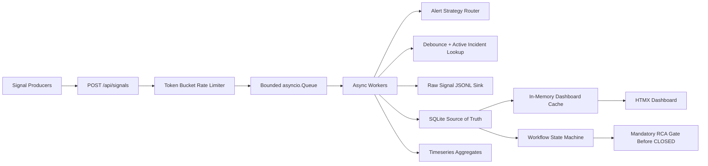

# Mission-Critical Incident Management System

This submission implements a resilient Incident Management System with an async ingestion pipeline, transactional incident workflow, append-only raw signal storage, severity-aware alert routing, and a responsive HTMX dashboard for incident triage and RCA capture.

## Stack choices

- `FastAPI` for the async API layer and lifecycle management
- `asyncio.Queue`, `TaskGroup`, and `Lock` for concurrency and backpressure-safe in-memory processing
- `SQLite (WAL)` via `aiosqlite` for transactional work items, RCA persistence, and time-series aggregates
- `JSONL` files as the raw signal audit sink
- `HTMX` + static CSS for a simple, zero-build frontend

## Architecture



## Repository layout

- `backend/app/` contains the API, workflow engine, storage adapters, rate limiter, and UI fragments.
- `frontend/` contains the HTMX dashboard.
- `sample-data/` contains a ready-made outage scenario and sender script.
- `docs/` captures the assignment spec, implementation plan, and build prompt record.

## How to run locally

### Option 1: Docker Compose

```bash
docker compose up --build
```

Open [http://localhost:8000](http://localhost:8000).

### Option 2: Python

```bash
python -m pip install -r backend/requirements.txt
python backend/run_server.py
```

Open [http://localhost:8000](http://localhost:8000).

## Clean demo flow

If you want a fresh reviewer demo each time, clear prior incidents first:

```bash
python sample-data/reset_demo_state.py
```

Then start the app:

```bash
python backend/run_server.py
```

In another terminal, inject the sample outage:

```bash
python sample-data/send_scenario.py
```

Now open `http://localhost:8000` and walk the flow:

1. Confirm the live feed shows `RDBMS`, `MCP_HOST`, and `CACHE` incidents sorted by severity.
2. Open the `RDBMS_PRIMARY_01` incident and verify multiple raw signals are linked to one work item.
3. Move the incident to `INVESTIGATING`, then `RESOLVED`.
4. Try closing without RCA first if you want to validate the guard through the API.
5. Fill the RCA form, save it, then close the incident.
6. Refresh the feed and confirm the closed incident disappears from active incidents.

## Sample data

The scenario below simulates an RDBMS outage followed by an MCP host dependency failure and a cache latency incident:

```bash
python sample-data/send_scenario.py
```

## Backpressure handling

The assignment asked specifically how slow persistence should avoid crashing ingestion. The backend handles that in three layers:

1. A token-bucket rate limiter protects the ingestion API from runaway callers.
2. A bounded `asyncio.Queue(maxsize=50000)` absorbs bursts and provides explicit backpressure.
3. If the queue saturates, the API returns `503` instead of letting memory grow without bound.

This is deliberate load shedding: under extreme stress the platform degrades predictably rather than falling over.

## Debouncing behavior

- One active incident is maintained per component while it remains open.
- The first signal creates the work item.
- Subsequent signals are appended to the same incident and linked in the raw-signal sink.
- The debounce registry tracks the opening window so bursts do not fan out into duplicate work items.

## Workflow and patterns

- `AlertStrategyRouter` applies the Strategy pattern to swap alerting logic by component type.
- `WorkflowStateMachine` applies the State pattern to enforce `OPEN -> INVESTIGATING -> RESOLVED -> CLOSED`.
- The `CLOSED` transition is rejected unless a complete RCA already exists.

## MTTR

MTTR is calculated automatically when the RCA is submitted:

- start: first signal timestamp recorded for the incident
- end: RCA submission timestamp

The RCA form still captures incident start/end values for the postmortem record.

## Observability

- `GET /health` exposes queue depth, worker count, active incident count, and throughput.
- Worker throughput is printed to the console every five seconds.
- `GET /api/metrics/timeseries` returns minute-bucket aggregates by severity.

## Tests

The repository includes unit coverage for the RCA close guard:

```bash
python -m unittest backend.tests.test_rca_validation
```

Additional coverage exercises:

```bash
python -m unittest backend.tests.test_service_flow
python -m unittest backend.tests.test_rate_limiter
```

## Notes for reviewers

- The frontend is intentionally served by the backend to keep setup friction low in a take-home environment.
- The raw signal sink is modeled as JSONL for simplicity; in production this would map cleanly to object storage plus a query engine such as ClickHouse, OpenSearch, or BigQuery.
