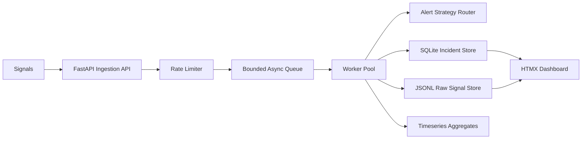

# Incident Management System

Submission repo for the Infrastructure / SRE intern assignment.

GitHub: [https://github.com/nidak7/mission-critical-ims-assignment-2026-04-30](https://github.com/nidak7/mission-critical-ims-assignment-2026-04-30)

## What it does

This project ingests high-volume failure signals, groups repeated signals for the same component into one incident, stores raw payloads separately from structured incident records, and drives the incident through:

`OPEN -> INVESTIGATING -> RESOLVED -> CLOSED`

An incident cannot be closed until a valid RCA is saved.

## Stack

- FastAPI
- asyncio
- SQLite
- HTMX
- JSONL raw signal store
- Docker Compose

## Architecture



## Storage split

- SQLite holds the structured source of truth: incidents, status transitions, RCA, and timeseries aggregates.
- JSONL files hold the raw signal payloads and alert audit log.
- An in-memory cache is used for the active incident feed so the dashboard does not hit SQLite on every refresh.

## Running locally

From the repo root:

```bash
python sample-data/reset_demo_state.py
python backend/run_server.py
```

If you already have an older local server running on port `8000`, stop it before running the reset script so the demo starts from a clean state.

Open:

```text
http://localhost:8000
```

Load the demo scenario in another terminal:

```bash
python sample-data/send_scenario.py
```

## Docker

```bash
docker compose up --build
```

The app is served at `http://localhost:8000`.

## Final submission PDF

`docs/Nida Farheen Khan - Infrastructure SRE Intern Assignment.pdf`

## Tests

Run the full suite:

```bash
python -m unittest discover -s backend/tests
```

## API examples

Create a signal:

```bash
curl -X POST http://localhost:8000/api/signals ^
  -H "Content-Type: application/json" ^
  -d "{\"component_id\":\"RDBMS_PRIMARY_01\",\"component_type\":\"RDBMS\",\"message\":\"Primary database is refusing connections from the API pool.\"}"
```

List active incidents:

```bash
curl http://localhost:8000/api/incidents
```

Health check:
```bash
curl http://localhost:8000/health
```

## Demo flow

1. Reset the demo state.
2. Start the app.
3. Run `python sample-data/send_scenario.py`.
4. Open the dashboard.
5. Select `RDBMS_PRIMARY_01`.
6. Click `Mark Investigating`.
7. Click `Mark Resolved`.
8. Fill the RCA form and save it.
9. Click `Close Incident`.

Expected sample incidents:

- `RDBMS_PRIMARY_01` as `P0`
- `MCP_HOST_02` as `P1`
- `CACHE_CLUSTER_01` as `P2`

## Reliability and non-functional work

- Async ingestion with a bounded in-memory queue
- Rate limiting on `/api/signals`
- Debouncing/grouping by component so bursts do not create duplicate incidents
- Retry wrapper for SQLite writes
- Transactional status transitions
- Throughput logging every 5 seconds
- `/health` endpoint for basic service checks
- Frontend gating for invalid workflow transitions
- Automated tests for API, workflow, RCA, MTTR, rate limiting, and dashboard state

## Backpressure

The ingestion endpoint does not write directly to SQLite. Signals are accepted into a bounded async queue and processed by workers. If the rate limiter trips, the API returns `429`. If the queue is saturated, the API returns `503` and sheds load instead of blocking until the process becomes unstable.

## Known limitations

- SQLite is fine for this assignment, but not the long-term choice for a real multi-node IMS.
- Raw signal storage is file-based JSONL for simplicity.
- The dashboard is intentionally minimal and focused on the assignment flow rather than full operator tooling.
